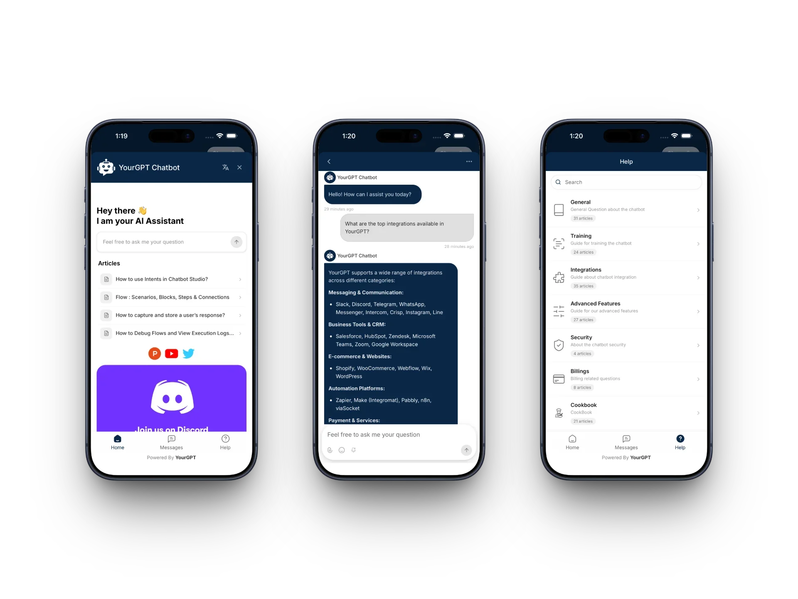

# YourGPT React Native SDK

A React Native SDK for integrating YourGPT chatbot widget into iOS and Android applications.

<p align="center">
  
</p>

## Quick Start

### Installation

```bash
npm install @yourgpt/chatbot-reactnative react-native-webview
```

Then install iOS pods:

```bash
cd ios && pod install && cd ..
```

### Step 1: Update Platform Configuration

**Android** — add internet permission to `android/app/src/main/AndroidManifest.xml`:

```xml
<uses-permission android:name="android.permission.INTERNET" />
```

**iOS** — no additional permissions needed for basic chat.

### Step 2: Initialize and Open the Chat Widget

```tsx
import React from 'react';
import { Button } from 'react-native';
import { YourGPTProvider, useYourGPT } from '@yourgpt/chatbot-reactnative';

function App() {
  return (
    <YourGPTProvider config={{ widgetUid: 'your-widget-uid' }}>
      <HomeScreen />
    </YourGPTProvider>
  );
}

function HomeScreen() {
  const { open } = useYourGPT();
  return <Button title="Open Chat" onPress={open} />;
}
```

That's it. The SDK handles the WebView, loading states, and lifecycle internally.

### Quick Initialize (One-Liner)

Initialises the SDK and sets up push notifications in minimalist mode with a single call. You still need `<YourGPTProvider>` in the component tree for the bottom sheet, but can omit the `config` prop:

```typescript
import {
  YourGPTSDK,
  registerNotificationHandler,
  YourGPTProvider,
} from '@yourgpt/chatbot-reactnative';

// index.js — must run before AppRegistry.registerComponent; required for
// Android notifications when the app is fully closed (killed state)
registerNotificationHandler();

// App.tsx — initialize + wrap with provider (no config needed)
await YourGPTSDK.quickInitialize('your-widget-uid');

function App() {
  return (
    <YourGPTProvider>
      <HomeScreen />
    </YourGPTProvider>
  );
}
```

---

## Upgrading from v1

Version 2.0 is a full rewrite (bottom-sheet UI, push notifications, events, session control), but the v1 API keeps working unchanged:

```tsx
// v1 code — still works in v2
import YourGPTProvider, { useYourGPT } from '@yourgpt/chatbot-reactnative';

<YourGPTProvider widgetId="YOUR_WIDGET_ID">...</YourGPTProvider>;

const { open, close } = useYourGPT();
```

Notes for v1 users:

- `widgetId` is deprecated — prefer `config={{ widgetUid: '...' }}`.
- `headerColor` is deprecated and ignored; the widget now renders in a themed bottom sheet.
- The default export is kept for compatibility; new code should use the named `YourGPTProvider` export.
- New optional peer dependencies (`react-native-safe-area-context`, Firebase messaging, push-notification-ios) are only needed if you use safe-area insets or push notifications — nothing new to install for basic chat.
- Installing `react-native-safe-area-context` and wrapping your app in `<SafeAreaProvider>` is recommended so the chat sheet respects device notches and home indicators; without it the SDK falls back to zero insets.

---

## Configuration

```typescript
import { YourGPTProvider, NotificationMode } from '@yourgpt/chatbot-reactnative';

<YourGPTProvider
  config={{
    widgetUid: 'your-widget-uid', // Required
    debug: true, // Optional: Enable debug logs (default: false)
    customParams: { lang: 'en' }, // Optional: Additional widget URL query params
    enableNotifications: true, // Optional: Enable push notifications (default: false)
    notificationMode: NotificationMode.MINIMALIST, // Optional: MINIMALIST, ADVANCED, or DISABLED
    autoRegisterToken: true, // Optional: Auto-register FCM/APNs token (default: true)
    baseUrl: undefined, // Optional: Override default widget URL
  }}
>
  {children}
</YourGPTProvider>;
```

### Push Notifications

```typescript
<YourGPTProvider
  config={{
    widgetUid: 'your-widget-uid',
    enableNotifications: true,
    notificationConfig: {
      soundEnabled: true,
      badgeEnabled: true,
      quietHoursEnabled: true,
      quietHoursStart: '22:00',
      quietHoursEnd: '08:00',
    },
  }}
>
  {children}
</YourGPTProvider>
```

#### iOS Setup

1. In Xcode, add **Push Notifications** and **Background Modes → Remote notifications** capabilities
2. Add one line to your `AppDelegate.swift`:

```swift
import yourgpt_react_native_sdk  // Add this import

// Inside didFinishLaunchingWithOptions, before React Native starts:
YourGPTApns.configure(application)
```

That's it — the SDK handles APNs token registration, foreground display, and notification tap events automatically. No manual delegate methods needed.

#### Android Setup

1. Add `google-services.json` to `android/app/`
2. Add `POST_NOTIFICATIONS` permission to `AndroidManifest.xml`

See [NOTIFICATION_SETUP.md](NOTIFICATION_SETUP.md) for complete setup instructions including Firebase configuration and dashboard setup.

---

## Opening the Chatbot

### Via hook (recommended)

```tsx
const { open } = useYourGPT();
open();
```

### Open a specific conversation

```tsx
const { openSession } = useYourGPT();
openSession('conversation-uid');
```

### Using the FloatingButton component

```tsx
import { YourGPTProvider, FloatingButton } from '@yourgpt/chatbot-reactnative';

<YourGPTProvider config={{ widgetUid: 'your-widget-uid' }}>
  <YourApp />
  <FloatingButton color="#2563eb" size={60} />
</YourGPTProvider>;
```

### Direct SDK access (outside React components)

```typescript
import { YourGPTSDK } from '@yourgpt/chatbot-reactnative';

YourGPTSDK.show();
YourGPTSDK.hide();
YourGPTSDK.openSession('conversation-uid');
```

---

## Widget Data Methods

Send data to the widget after it's opened. Available via the `useYourGPT()` hook or the `YourGPTSDK` singleton:

```tsx
const {
  setUserContext,
  setSessionData,
  setVisitorData,
  setContactData,
  sendMessage,
} = useYourGPT();

// Send user identification data
setUserContext({ userId: 'user_123', plan: 'premium' });

// Send session-specific data
setSessionData({ orderId: '12345', sessionUid: 'optional-session-uid' });

// Send visitor data (auto-enriched with device info: platform, osVersion, deviceModel, locale)
setVisitorData({ name: 'John', email: 'john@example.com' });

// Send contact information
setContactData({ email: 'john@example.com', phone: '+1234567890' });

// Send a message programmatically
sendMessage('Hello!');
```

---

## Event Handling

### Global Event Listener

Implement the `YourGPTEventListener` interface to receive SDK-wide events:

```typescript
import { YourGPTSDK } from '@yourgpt/chatbot-reactnative';
import type { YourGPTEventListener } from '@yourgpt/chatbot-reactnative';

const listener: YourGPTEventListener = {
  // Required — widget lifecycle events
  onMessageReceived: message => console.log('Message:', message),
  onChatOpened: () => console.log('Chat opened'),
  onChatClosed: () => console.log('Chat closed'),
  onError: error => console.error('Error:', error),
  onLoadingStarted: () => console.log('Loading...'),
  onLoadingFinished: () => console.log('Loaded'),

  // Optional — notification events
  onPushTokenReceived: token => console.log('Push token:', token),
  onPushMessageReceived: data => console.log('Push message:', data),
  onNotificationClicked: data => console.log('Notification tapped:', data),
  onNotificationPermissionGranted: () =>
    console.log('Notification permission granted'),
  onNotificationPermissionDenied: () =>
    console.log('Notification permission denied'),
  onPushTokenError: error => console.error('Token error:', error),
  onBadgeCountChanged: count => console.log('Badge:', count),
};

YourGPTSDK.setEventListener(listener);
```

### Per-Event Listeners

```typescript
import { YourGPTSDK, WidgetEvent } from '@yourgpt/chatbot-reactnative';

const onMessage = payload => console.log('New message:', payload);

// Subscribe
YourGPTSDK.on(WidgetEvent.MESSAGE_RECEIVED, onMessage);

// Unsubscribe
YourGPTSDK.off(WidgetEvent.MESSAGE_RECEIVED, onMessage);
```

### Via hook

```tsx
const { on, off, setEventListener } = useYourGPT();
```

---

## SDK State

### useSDKState hook

```tsx
import { useSDKState } from '@yourgpt/chatbot-reactnative';

function StatusBar() {
  const state = useSDKState();

  return (
    <View>
      <Text>Initialized: {state.isInitialized ? 'Yes' : 'No'}</Text>
      <Text>Connection: {state.connectionState}</Text>
      <Text>Loading: {state.isLoading ? 'Yes' : 'No'}</Text>
      <Text>Badge: {state.badgeCount}</Text>
      {state.error && <Text>Error: {state.error}</Text>}
    </View>
  );
}
```

### Connection States

| State          | Description                    |
| -------------- | ------------------------------ |
| `DISCONNECTED` | Not connected to the widget    |
| `CONNECTING`   | Widget is loading              |
| `CONNECTED`    | Widget is loaded and connected |
| `ERROR`        | An error occurred              |

### Direct state access

```typescript
import { YourGPTSDK } from '@yourgpt/chatbot-reactnative';

const state = YourGPTSDK.currentState;
const isReady = YourGPTSDK.isReady;

// Subscribe to state changes (returns unsubscribe function)
const unsubscribe = YourGPTSDK.subscribeToState(newState => {
  console.log('State changed:', newState);
});
```

---

## Error Handling

| Error Code            | Description                                              |
| --------------------- | -------------------------------------------------------- |
| `NOT_INITIALIZED`     | SDK has not been initialized — call `initialize()` first |
| `INVALID_CONFIG`      | Configuration is invalid or missing required fields      |
| `WEBVIEW_ERROR`       | An error occurred in the WebView                         |
| `NETWORK_ERROR`       | A network error occurred                                 |
| `NOTIFICATION_DENIED` | Notification permission was denied                       |
| `BRIDGE_PARSE_ERROR`  | Failed to parse a message from the WebView bridge        |

---

## Requirements

- React Native >= 0.72
- React >= 18
- iOS 13.0+
- Android API 21+
- Node.js >= 20

### Peer Dependencies

| Package                                         | Required | Purpose                                                               |
| ----------------------------------------------- | -------- | --------------------------------------------------------------------- |
| `react-native-webview`                          | Yes      | WebView for chat widget                                               |
| `react-native-safe-area-context`                | Optional | Safe area handling                                                    |
| `@react-native-firebase/messaging`              | Optional | Android push notifications                                            |
| `@react-native-community/push-notification-ios` | Optional | iOS push fallback (built-in native module handles this automatically) |

---

## Example App

For a complete working example, see the `example/` directory.

### Running the Example

```bash
# Install dependencies
cd example && npm install

# iOS
cd ios && pod install && cd ..
npm run ios

# Android
npm run android
```

---

## Support

- Documentation: [https://docs.yourgpt.ai](https://docs.yourgpt.ai)
- Issues: [GitHub Issues](https://github.com/YourGPT/chatbot-reactnative/issues)
- Email: support@yourgpt.ai
